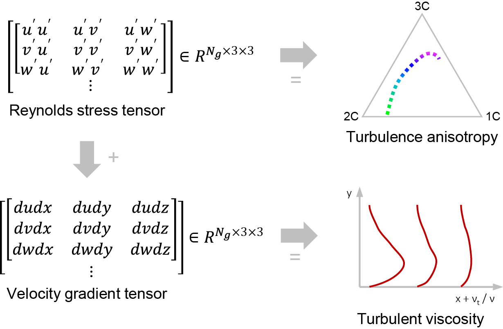
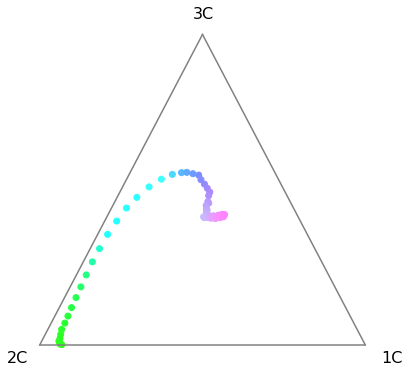

<p align="center">
    
</p>

---

# Turbulence Analyzer in Python

This repository contains a Python toolkit that calculates and visualizes turbulence anisotropy and turbulent viscosity from Reynolds stress components. A graphical abstract of this package is illustrated in the following figure.

<p align="center">
    
</p>

If this script appears useful for your research, an explicit mention of the work [[2](#ddes-bstep)] (for turbulence anisotropy) and [[3](#SA-ML)] (for turbulent viscosity) would be highly appreciated.

## Quick Start


### Step 1: Download package
#### Download from Git clone in the terminal

git clone [https://github.com/HexFluid/TurbAna.git](https://github.com/HexFluid/TurbAna.git)

#### Download from browser

Download from this [link](https://github.com/HexFluid/TurbAna/archive/master.zip) and then unzip it.

### Step 2: Install prerequisites
Launch a terminal (UNIX) or an Anaconda Prompt (Windows) window and change directory to *TurbAna*. Run the following command line to install/upgrade the prerequisite Python packages.

```
pip install -r requirements.txt
```

### Step 3: Load example data
Run the following script with Python 3 to load the data:
```python
import h5py
import os

current_path = os.getcwd() # assuming Python launched in the 'TurbAna' dir
data_path    = os.path.join(current_path,'tutorials','bstep_data','bstep_DNS.h5')

h5f  = h5py.File(data_path,'r')
Grid = h5f['grid'][:]         # grid point coordinates
TurbStat = h5f['TurbStat'][:] # Reynolds stress components
h5f.close()
```

### Step 4: Calculate and visualize turbulence anisotropy
Run the following script to visualize turbulence anisotropy in the barycentric map:
```python
import TurbAna
import matplotlib.pyplot as plt

sel_idx = (Grid[:,0]==4)&(Grid[:,1]<=1) # selected profile at x/H=4
RST = TurbAna.ReynoldsStressTensor(TurbStat[sel_idx,:]) # Reynolds stress tensor
coors = RST.BaryTriCoor() # Barycentric map coordinates: xB and yB
RGB = RST.AniRGB() # RGB color values from turbulence anisotropy eigenvalues

fig = TurbAna.plot_bary_tri()
plt.scatter(coors[:,0], coors[:,1], facecolors=RGB, zorder=0)
```

Expected results:
<p align="left">
    
</p>

For more postprocess tutorials including plotting turbulence anisotropy contours and turbulent viscosity, please refer to the scripts with detailed comments in [tutorials](./tutorials/README.md).


## List of Files

<pre>
.
|-- docs
|   |-- figs
|-- tutorials
|   |-- bstep_data
|   |   |-- results
|   |   |-- bstep_DDES.h5
|   |   |-- bstep_DNS.h5
|   |-- bump_data
|   |   |-- results
|   |   |-- bump_LES.h5
|   |-- cooling_data
|   |   |-- results
|   |   |-- cooling_DDES.h5
|   |-- SBLI_data
|   |   |-- results
|   |   |-- SBLI_DNS.h5
|   |-- 01_bstep.py
|   |-- 02_bump.py
|   |-- 03_cooling.py
|   |-- 04_SBLI.py
|-- LICENSE
|-- requirements.txt
|-- TurbAna.py
</pre>

- **TurbAna.py**: main script of turbulence analyzer
- **requirements.txt**: a list of prerequisite Python libraries
- **LICENSE**: license file
- **tutorials**
  - **bstep_data**
    - **results**: postprocess results of the backstep case
    - **bstep_DDES.h5**: DDES data (HDF5 format)
    - **bstep_DNS.h5**: DNS data (HDF5 format)
  - **bump_data**
    - **results**: postprocess results of the bump case
    - **bump_LES.h5**: LES data (HDF5 format)
  - **cooling_data**
    - **results**: postprocess results of the cooling case
    - **cooling_DDES.h5**: DDES data (HDF5 format)
  - **SBLI_data**
    - **results**: postprocess results of the SBLI case
    - **SBLI_DNS.h5**: DNS data (HDF5 format)
  - **01_bstep.py**: tutorial script for the backward-facing step case
  - **02_bump.py**: tutorial script for the transonic bump case
  - **03_cooling.py**: tutorial script for the film cooling case
  - **04_SBLI.py**: tutorial script for the shock/boundary layer interaction (SBLI) case
- **docs**
  - **figs**: figures appeared in the markdown files

## References
[<a id="anisotropy">1</a>] Emory, M., & Iaccarino, G. (2014). Visualizing turbulence anisotropy in the spatial domain with componentality contours. Center for Turbulence Research Annual Research Briefs, 123-138. [[link](https://web.stanford.edu/group/ctr/ResBriefs/2014/14_emory.pdf)]

[<a id="ddes-bstep">2</a>] He, X., Zhao, F., & Vahdati, M. (2022). Detached eddy simulation: recent development and application to compressor tip leakage flow. ASME Journal of Turbomachinery, 144(1), 011009. [[DOI](https://doi.org/10.1115/1.4052019)][[preprint](https://www.researchgate.net/publication/347355348_Detached_Eddy_Simulation_Recent_Development_and_Application_to_Compressor_Tip_Leakage_Flow)]

[<a id="SA-ML">3</a>] He, X., Tan, J., Rigas, G., & Vahdati, M. (2022). On the Explainability of Machine-Learning-Assisted Turbulence Modeling for Transonic Flows. International Journal of Heat and Fluid Flow, 97, 109038.  [[preprint](https://www.researchgate.net/publication/344903748_On_the_Explainability_of_Machine-Learning-Assisted_Turbulence_Modeling_for_Transonic_Flows)]
