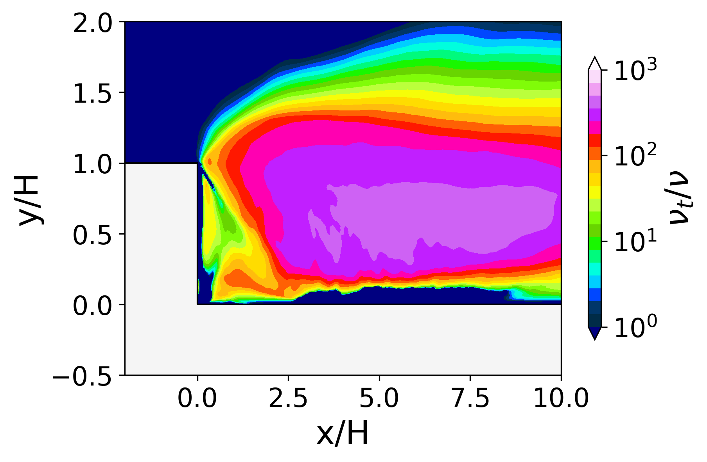
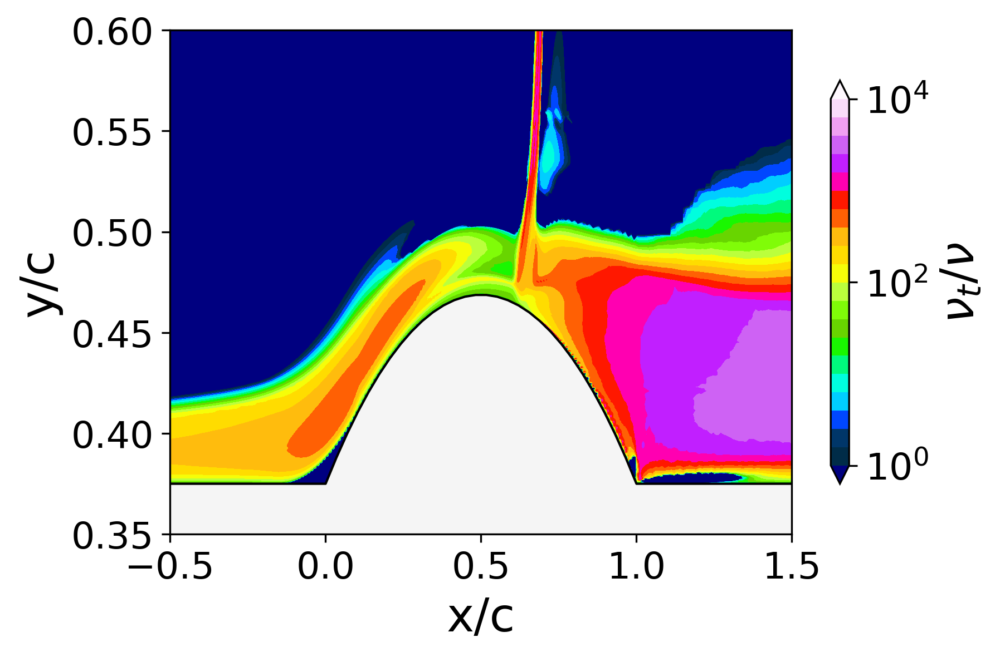
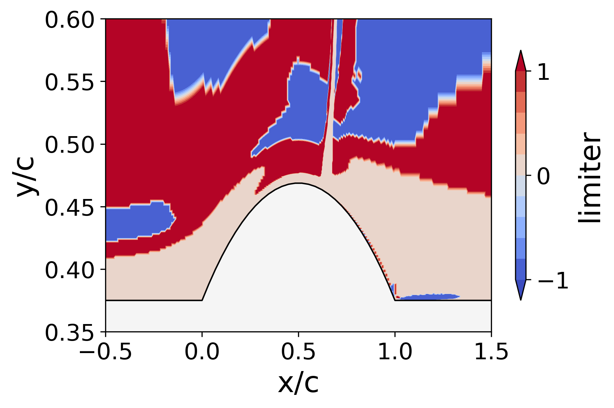
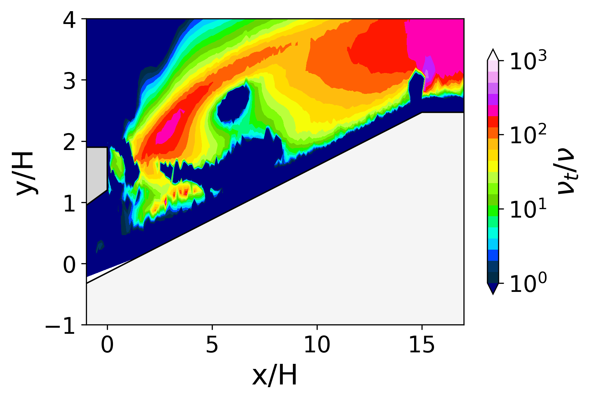
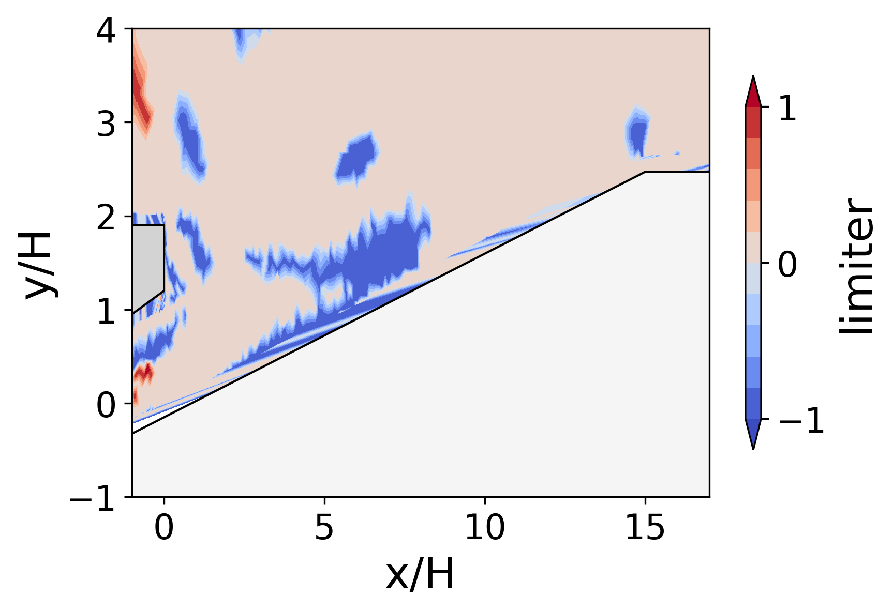
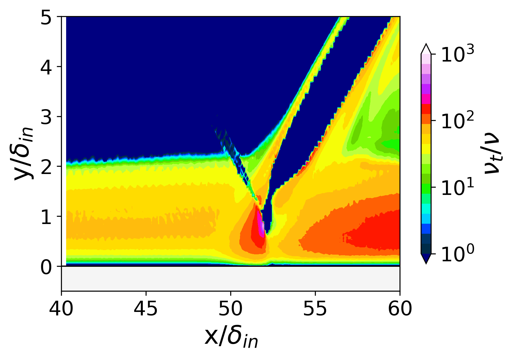
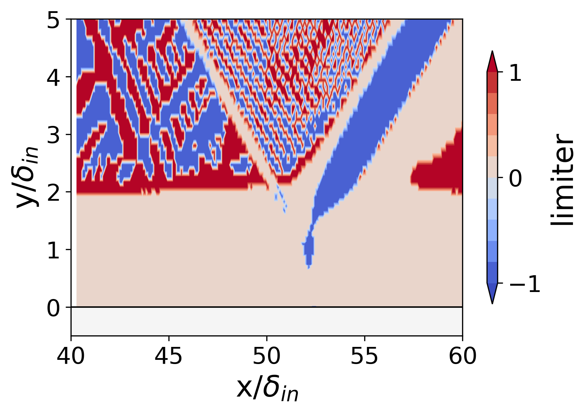

## Tutorials

We present four case studies in fluid mechanics using *TurbAna*:
- 2D backward-facing step [[1](#dns-bstep),[2](#ddes-bstep)]: **01_bstep.py**
- 2D transonic bump [[1](#les-bump),[2](#rans-bump)]: **02_bump.py**
- 2D turbine film cooling [[3](#ddes-cool)]: **03_cooling.py**
- 2D shock/boundary layer interaction [[3](#dns-sbli)]: **04_SBLI.py**

This page briefly introduces the flow physics of each case and the major results of *TurbAna*. The tutorial scripts are well-commented, self-explanatory, and easily transferrable to other cases. If you are using any data from the tutorial cases, please explicitly mention the corresponding publications.

---
### Case 1: 2D backward-facing step
The backward-facing step flow is composed of an attached region, a separated region (due to sudden change of geometry) and a re-attached region. It is one of the standard test cases for DES-type methods. The data analyzed in this case is time-averaged and spanwise-averaged DNS data from Le et al. [[1](#dns-comp)] and time-averaged and spanwise-averaged DDES data from He et al. [[2](#ddes-comp)]. The Reynolds numbers for the DNS and the DDES data are 5,100 and 36,000, respectively. The figure below illustrates the flow schematics.

<figure>

    
    <figcaption align="left"> Flow schematic of backward-facing step </figcaption>

</figure>

The figures below present the expected turbulence anisotropy triangles of the profile at x/H=4 and 0<y/H<1.

<figure>

    
    
    
    <figcaption align="left"> (left): Lumley triangle; (medium): turbulence triangle; (right): barycentric map </figcaption>

</figure>

<figure>

    
    
    <figcaption align="left"> Reynolds stress anisotropy componentality contour </figcaption>

</figure>

<figure>

    
    
    <figcaption align="left"> (left): viscosity ratio contour; (right): limiter contour </figcaption>

</figure>

---
### Case 2: 2D transonic bump

<figure>

    
    <figcaption align="left"> Flow schematic of transonic bump </figcaption>

</figure>

<figure>

    
    
    <figcaption align="left"> Reynolds stress anisotropy componentality contour </figcaption>

</figure>

<figure>

    
    
    <figcaption align="left"> (left): viscosity ratio contour; (right): limiter contour </figcaption>

</figure>

---
### Case 3: 2D turbine film cooling
The 2D trailing edge cutback film cooling flow is feature by the mixing between the hot mainstream and the coolant in the trailing edge wake region. The data analyzed in this case is a time-averaged 2D slice of the DDES data from Wang and Yan [[3](#ddes-cool)], and the working condition is at a Reynolds number of 6,200, a Strouhal number of 0.20 and a blowing ratio of 0.5. The figure below illustrates the flow schematics.

<figure>

    
    <figcaption align="left"> Flow schematic of turbine film cooling </figcaption>

</figure>

<figure>

    
    
    <figcaption align="left"> Reynolds stress anisotropy componentality contour </figcaption>

</figure>

<figure>

    
    
    <figcaption align="left"> (left): viscosity ratio contour; (right): limiter contour </figcaption>

</figure>

---
### Case 4: 2D shock/boundary layer interaction

<figure>

    
    <figcaption align="left"> Flow schematic of shock/boundary layer interaction </figcaption>

</figure>

<figure>

    
    
    <figcaption align="left"> Reynolds stress anisotropy componentality contour </figcaption>

</figure>

<figure>

    
    
    <figcaption align="left"> (left): viscosity ratio contour; (right): limiter contour </figcaption>

</figure>

---
## References
[<a id="dns-bstep">1</a>] Le, H., Moin, P., & Kim, J. (1997). Direct numerical simulation of turbulent flow over a backward-facing step. Journal of Fluid Mechanics, 330, 349-374. [[DOI](https://doi.org/10.1017/S0022112096003941)]

[<a id="ddes-bstep">2</a>] He, X., Zhao, F., & Vahdati, M. (2022). Detached eddy simulation: recent development and application to compressor tip leakage flow. ASME Journal of Turbomachinery, 144(1), 011009. [[DOI](https://doi.org/10.1115/1.4052019)][[preprint](https://www.researchgate.net/publication/347355348_Detached_Eddy_Simulation_Recent_Development_and_Application_to_Compressor_Tip_Leakage_Flow)]

[<a id="ddes-cool">3</a>] Wang, R., & Yan, X. (2021). Delayed-detached eddy simulations of film cooling effect on trailing edge cutback with land extensions. ASME Journal of Engineering for Gas Turbines and Power. (online) [[DOI](https://doi.org/10.1115/1.4051865)]
