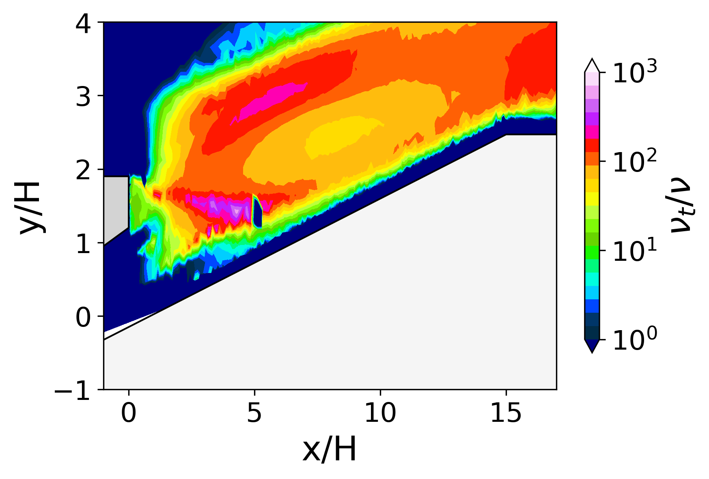
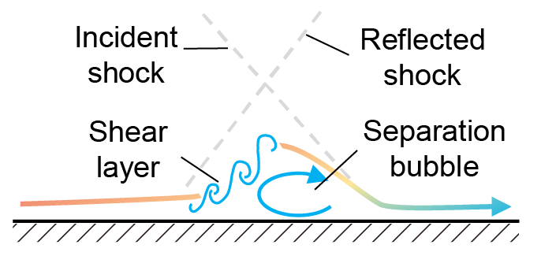

## Tutorials

We present four case studies in fluid mechanics using *TurbAna*:
- 2D backward-facing step [[1](#dns-bstep),[2](#ddes-bstep)]: **01_bstep.py**
- 2D transonic bump [[3](#les-bump)]: **02_bump.py**
- 2D turbine film cooling [[4](#ddes-cool)]: **03_cooling.py**
- 2D shock/boundary layer interaction [[5](#dns-sbli)]: **04_SBLI.py**

This page briefly introduces the flow physics of each case and the major results of *TurbAna*. The tutorial scripts are well-commented, self-explanatory, and easily transferrable to other cases. If you are using any data from the tutorial cases, please explicitly mention the corresponding publications.

---
### Case 1: 2D backward-facing step
The backward-facing step flow is composed of an attached boundary layer, a separated region (due to a sudden change of geometry) and a re-attached boundary layer. It is one of the standard test cases for DES-type methods. The data analyzed in this case is time-averaged and spanwise-averaged DNS data from Le et al. [[1](#dns-bstep)] and DDES data from He et al. [[2](#ddes-bstep)]. The Reynolds numbers for the DNS and the DDES data are *ReH=5100* and *ReH=36000*, respectively. The figure below illustrates the flow schematics.

<figure>

    
    <figcaption align="left"> Flow schematic of backward-facing step </figcaption>

</figure>

After reading the turbulence statistics data and defining it as a native *ReynoldsStressTensor* type, the turbulence anisotropy tensor and its eigenvalues are automatically calculated. The turbulence anisotropy can be visualized in Lumley Triangle, Turbulence Triangle and Barycentric Map by using methods of *.LumleyTriCoor()*, *.TurbTriCoor()* and *.BaryTriCoor()*, respectively. The figures below present an example visualization of the profile at x/H=4 and 0<y/H<1.

<figure>

    
    
    
    <figcaption align="left"> (left): Lumley triangle; (medium): turbulence triangle; (right): barycentric map </figcaption>

</figure>

It is also possible to visualize the turbulence anisotropy in the flow domain. By using the method of *.AniRGB(c_off,c_exp)*, the turbulence anisotropy state is represented by a color, which is indicated by a barycentric color map. With *coff=0.65* and *cexp=5*, the Reynolds stress anisotropy componentality contour and the barycentric colormap are obtained as the following figures.

<figure>

    
    
    <figcaption align="left"> (left): Reynolds stress anisotropy componentality contour; (right): barycentric colormap </figcaption>

</figure>

With the mean flow field and the gradient field data read-in as a native *MeanFlowField* type variable and a *MeanGradField* type variable, the turbulent viscosity field can be derived. This is achieved by using the build-in function of *.calc_EddyVisc()* with additional input including a reference strain rate value and a constitutive relation (e.g., Bousinessq, QCR). The left figure below shows the derived turbulent-to-laminar viscosity ratio using the QCR and *Sref=30s-1*; the right figure shows the limiter *flim* applied to the derivation, where *flim=0,1,2,3* represent no limiter applied, *Sref* applied, *νt ≥ 0* applied or both limiters applied, respectively.

<figure>

    
    
    <figcaption align="left"> (left): viscosity ratio contour; (right): limiter contour </figcaption>

</figure>

---
### Case 2: 2D transonic bump
The axisymmetric transonic bump flow is featured by streamline curvature and shock-induced flow separation. The data analyzed in this case is time-averaged and circumferentially-averaged LES data from Uzun and Malik [[3](#les-bump)]. The Reynolds numbers of the problem is *Rec=2763000*. The figure below illustrates the flow schematics.

<figure>

    
    <figcaption align="left"> Flow schematic of transonic bump </figcaption>

</figure>

With the method of *.AniRGB(c_off=0.65,c_exp=5)*, the Reynolds stress anisotropy componentality contour and the barycentric colormap are obtained as the following figures.

<figure>

    
    
    <figcaption align="left"> (left): Reynolds stress anisotropy componentality contour; (right): barycentric colormap </figcaption>

</figure>

With the function of *.calc_EddyVisc()* using the QCR and *Sref=1000s-1*, the turbulent-to-laminar viscosity ratio and the limiter *flim* contours are obtained as follows.

<figure>

    
    
    <figcaption align="left"> (left): viscosity ratio contour; (right): limiter contour </figcaption>

</figure>

---
### Case 3: 2D turbine film cooling
The 2D trailing edge cutback film cooling flow is feature by the mixing between the hot mainstream and the coolant in the trailing edge wake region. The data analyzed in this case is a time-averaged 2D slice of the DDES data from Wang and Yan [[4](#ddes-cool)], and the working condition is at a Reynolds number of *ReH=6200*, a Strouhal number of 0.20 and a blowing ratio of 0.5. The figure below illustrates the flow schematics.

<figure>

    
    <figcaption align="left"> Flow schematic of turbine film cooling </figcaption>

</figure>

With the method of *.AniRGB(c_off=0.65,c_exp=5)*, the Reynolds stress anisotropy componentality contour and the barycentric colormap are obtained as the following figures.

<figure>

    
    
    <figcaption align="left"> (left): Reynolds stress anisotropy componentality contour; (right): barycentric colormap </figcaption>

</figure>

With the function of *.calc_EddyVisc()* using the QCR and *Sref=1000s-1*, the turbulent-to-laminar viscosity ratio and the limiter *flim* contours are obtained as follows.

<figure>

    
    
    <figcaption align="left"> (left): viscosity ratio contour; (right): limiter contour </figcaption>

</figure>

---
### Case 4: 2D shock/boundary layer interaction
The 2D shock/boundary layer interaction flow is featured by shock-induced flow separation. The data analyzed in this case is time-averaged and spanwise-averaged DNS data from Pirozzoli and Bernardini [[5](#dns-sbli)]. The Reynolds numbers of the problem is *Reθ=2300*. The figure below illustrates the flow schematics.

<figure>

    
    <figcaption align="left"> Flow schematic of shock/boundary layer interaction </figcaption>

</figure>

With the method of *.AniRGB(c_off=0.65,c_exp=5)*, the Reynolds stress anisotropy componentality contour and the barycentric colormap are obtained as the following figures.

<figure>

    
    
    <figcaption align="left"> (left): Reynolds stress anisotropy componentality contour; (right): barycentric colormap </figcaption>

</figure>

With the function of *.calc_EddyVisc()* using the QCR and *Sref=100s-1*, the turbulent-to-laminar viscosity ratio and the limiter *flim* contours are obtained as follows.

<figure>

    
    
    <figcaption align="left"> (left): viscosity ratio contour; (right): limiter contour </figcaption>

</figure>

---
## References
[<a id="dns-bstep">1</a>] Le, H., Moin, P., & Kim, J. (1997). Direct numerical simulation of turbulent flow over a backward-facing step. Journal of Fluid Mechanics, 330, 349-374. [[DOI](https://doi.org/10.1017/S0022112096003941)]

[<a id="ddes-bstep">2</a>] He, X., Zhao, F., & Vahdati, M. (2022). Detached eddy simulation: recent development and application to compressor tip leakage flow. ASME Journal of Turbomachinery, 144(1), 011009. [[DOI](https://doi.org/10.1115/1.4052019)][[preprint](https://www.researchgate.net/publication/347355348_Detached_Eddy_Simulation_Recent_Development_and_Application_to_Compressor_Tip_Leakage_Flow)]

[<a id="les-bump">3</a>] Uzun, A., & Malik, M. (2019). Wall-resolved large-eddy simulations of transonic shock-induced flow separation. AIAA Journal, 57(5), 1955-1972. [[DOI](https://doi.org/10.2514/1.J057850.)]

[<a id="ddes-cool">4</a>] Wang, R., & Yan, X. (2021). Delayed-detached eddy simulations of film cooling effect on trailing edge cutback with land extensions. ASME Journal of Engineering for Gas Turbines and Power, 143(11), 111004. [[DOI](https://doi.org/10.1115/1.4051865)]

[<a id="dns-sbli">5</a>] Pirozzoli, S., & Bernardini, M. (2011). Direct numerical simulation database for impinging shock wave/turbulent boundary-layer interaction. AIAA Journal, 49(6), 1307-1312. [[DOI](https://doi.org/10.2514/1.J050901)]
